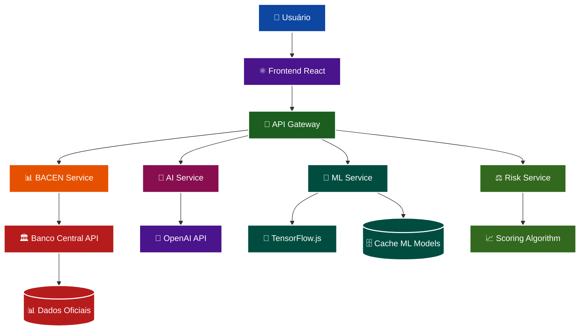
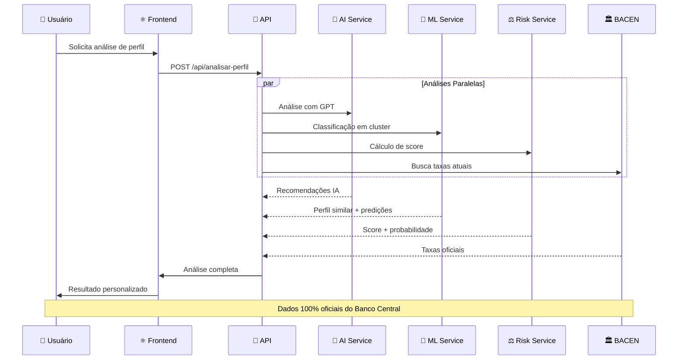

# 🏦 CREDITECH

**Plataforma inteligente de comparação de crédito com IA e Machine Learning**

Aplicação web avançada que utiliza **Inteligência Artificial** e **dados oficiais do Banco Central** para análise e comparação de taxas de crédito no Brasil.

[](https://nodejs.org)
[](https://reactjs.org)
[](https://www.tensorflow.org/js)
[](https://dadosabertos.bcb.gov.br/)

## 🚀 Funcionalidades Principais

### 📊 **Dados e Comparação**
- **API Oficial BACEN**: Integração direta com dados do Banco Central
- **Comparação em Tempo Real**: Taxas atualizadas automaticamente
- **Múltiplas Modalidades**: Crédito pessoal, veículos, imóveis, cartão

### 🤖 **Inteligência Artificial**
- **Chat Inteligente**: Assistente financeiro especializado
- **Análise de Perfil**: IA avalia seu risco e sugere melhores opções
- **Predição de Taxas**: Machine Learning prevê tendências futuras
- **Insights Automáticos**: Recomendações personalizadas baseadas em dados

### 🧮 **Machine Learning**
- **Rede Neural**: Modelo TensorFlow.js treinado com 5 anos de dados históricos do BACEN
- **Clustering K-Means**: Agrupamento de perfis similares
- **Scoring de Risco**: Algoritmo proprietário de classificação
- **Análise Preditiva**: Previsão de aprovação baseada em dados históricos

## 💳 Modalidades de Crédito Suportadas

- 👤 **Crédito Pessoal** - Pessoa Física
- 📧 **Cheque Especial** - Pessoa Física  
- 💳 **Cartão de Crédito Rotativo** - Pessoa Física
- 🏢 **Capital de Giro** - Pessoa Jurídica
- 🏠 **Financiamento Habitacional**
- 🌾 **Crédito Rural** - Custeio
- 🚗 **Financiamento de Veículos**

## ⚡ Stack Tecnológica

### 🔧 **Backend**
- **Node.js** + **Express.js** - Servidor API
- **TensorFlow.js** - Machine Learning
- **OpenAI GPT** - Inteligência Artificial  
- **ml-kmeans** - Clustering de usuários
- **Axios** - Requisições HTTP para BACEN
- **CORS** - Segurança de API

### 💻 **Frontend**
- **React.js** - Interface moderna (Hooks)
- **CSS3** - Design responsivo e animações
- **Axios** - Comunicação com API
- **Chat Interface** - Componente IA integrado

### 🧠 **Inteligência Artificial**
- **@tensorflow/tfjs-node** - Redes neurais
- **ml-matrix** - Operações matemáticas ML  
- **OpenAI API** - Chat inteligente (requer chave)

## 📦 Instalação e Execução

### ✅ **Pré-requisitos**
- **Node.js** 18+ 
- **npm** ou yarn
- **Chave OpenAI** (opcional, para chat IA avançado)

### 🚀 **Instalação Rápida**

```bash
# 📥 Clonar repositório
git clone <repositorio>
cd creditech

# 📦 Instalar todas as dependências
npm run install-all
```

### ▶️ **Execução**

```bash
# 🚀 Executar aplicação completa (recomendado)
npm run dev
```

**Ou executar separadamente:**
```bash
# 🔧 Backend com IA/ML (porta 5000)
npm run server

# 💻 Frontend React (porta 3000) 
npm run client
```

### 🌐 **Acesso**
- **Frontend**: http://localhost:3000
- **API Backend**: http://localhost:5000
- **Chat IA**: Integrado no frontend
- **Health Check**: http://localhost:5000/api/health

## 📁 Arquitetura do Projeto

```
creditech/
├── server/
│   ├── index.js              # 🔧 Servidor principal + rotas
│   └── services/
│       ├── aiService.js      # 🤖 Chat IA e análises inteligentes
│       ├── mlService.js      # 🧮 Machine Learning (TensorFlow)
│       └── riskService.js    # ⚖️ Análise de risco e scoring
├── client/
│   ├── public/
│   │   └── index.html        # 📄 HTML base
│   └── src/
│       ├── App.js            # ⚛️ Componente principal React
│       ├── components/
│       │   ├── ChatIA.js     # 💬 Interface de chat inteligente
│       │   └── ChatIA.css    # 🎨 Estilos do chat
│       └── *.css            # 🎨 Estilos globais
├── package.json              # 📦 Dependências
└── README.md                 # 📚 Documentação
```

## 🔌 API Endpoints

### 📊 **Dados do BACEN**
- `GET /api/health` - Status geral da API
- `GET /api/taxas-credito` - Busca taxas por modalidade
- `GET /api/comparar-taxas` - Compara múltiplas modalidades  
- `GET /api/indicadores` - SELIC e IPCA em tempo real

### 🤖 **Inteligência Artificial**
- `POST /api/chat` - Chat inteligente com assistente IA
- `POST /api/analisar-perfil` - Análise completa de perfil
- `GET /api/insights-ia` - Insights automáticos baseados em dados
- `POST /api/explicar-modalidades` - Explicações didáticas

### 🧮 **Machine Learning**  
- `GET /api/prever-taxas/:modalidade` - Predição de taxas futuras
- `POST /api/analise-risco` - Scoring e classificação de risco
- `GET /api/clusters` - Agrupamentos de perfis similares
- `GET /api/stats-ml` - Estatísticas dos modelos ML

## 🏛️ Fonte dos Dados

**API oficial do Banco Central do Brasil** (100% confiável):
- 📊 **Portal**: https://dadosabertos.bcb.gov.br/
- 💰 Taxas médias praticadas pelas instituições financeiras
- 📈 Séries temporais oficiais (SELIC, IPCA)
- ⏱️ Dados atualizados dos últimos 5 dias úteis

## 🎯 Funcionalidades Inteligentes

### 🤖 **Análise Automatizada com IA**
- ✅ Identificação da melhor opção de crédito
- ⚖️ Classificação de risco personalizada (baixa, média, alta)
- 💵 Cálculo de economia potencial em tempo real
- 📋 Recomendações baseadas em perfil individual

### 🧮 **Machine Learning Avançado**
- 🔮 **Predição de Taxas**: Rede neural treinada com 5 anos de dados históricos do BACEN
- 👥 **Clustering de Usuários**: Agrupa perfis similares usando K-means
- 🎯 **Scoring de Risco**: Algoritmo proprietário de classificação
- 📊 **Análise Preditiva**: Probabilidade de aprovação baseada em dados reais

## ⚙️ Configuração Avançada

### 🔐 **Variáveis de Ambiente**
```env
# Servidor
PORT=5000
NODE_ENV=production

# IA (opcional - sem ela usa fallbacks básicos)
OPENAI_API_KEY=sua_chave_aqui
```

### ⚠️ **Notas Importantes**

**Funciona sem configuração adicional:**
- ✅ Todas as APIs implementadas
- ✅ Machine Learning treinado com 5 anos de dados históricos do BACEN
- ✅ Dados em tempo real do BACEN
- ✅ Interface completa com chat

**Requer configuração para funcionar 100%:**
- 🔑 **OpenAI API**: Sem chave → chat usa respostas básicas predefinidas

### 🏗️ **Build para Produção**
```bash
# Frontend otimizado
npm run build

# Deploy completo
npm install && cd client && npm install && npm run build
```

## 📝 Exemplos de Uso

### 🤖 **Chat Inteligente com IA**
```javascript
// Request
POST /api/chat
{
  "message": "Qual a diferença entre crédito pessoal e financiamento?",
  "sessionId": "user_123"
}

// Response
{
  "success": true,
  "data": {
    "response": "Crédito pessoal tem taxas mais altas (20-40% a.m.) mas não precisa de garantia. Financiamento tem taxas menores (1-3% a.m.) mas o bem financiado fica como garantia. Para valores altos, financiamento é mais vantajoso.",
    "sessionId": "user_123",
    "messageCount": 2
  }
}
```

### 🧮 **Análise Completa de Perfil**
```javascript
// Request
POST /api/analisar-perfil
{
  "renda": 5000,
  "idade": 35,
  "score": 720,
  "profissao": "clt",
  "valorSolicitado": 25000,
  "finalidade": "veiculo"
}

// Response
{
  "success": true,
  "data": {
    "analiseRisco": {
      "scoreRisco": 785,
      "classificacao": "Muito Bom",
      "probabilidadeAprovacao": 88,
      "taxaSugerida": 18.5,
      "limiteSugerido": 35000,
      "recomendacoes": [
        "Você tem perfil para as melhores condições do mercado",
        "Negocie desconto nas taxas oferecidas"
      ]
    },
    "cluster": {
      "cluster": {
        "descricao": "Perfil Padrão: Renda média, bom score",
        "taxaSugerida": 19.2
      },
      "similaridade": "92.3%"
    }
  }
}
```

### 🔮 **Predição de Taxas Futuras**
```javascript
// Request
GET /api/prever-taxas/pessoa-fisica-credito-pessoal?dias=7

// Response
{
  "success": true,
  "data": {
    "modalidade": "pessoa-fisica-credito-pessoal",
    "predicoes": [
      {
        "data": "17/09/2025",
        "taxaPrevista": 26.8,
        "confianca": 0.87
      },
      {
        "data": "18/09/2025", 
        "taxaPrevista": 26.9,
        "confianca": 0.85
      }
    ],
    "diasFuturos": 7
  }
}
```

### ⚖️ **Análise de Risco Detalhada**
```javascript
// Request
POST /api/analise-risco
{
  "renda": 3000,
  "idade": 28,
  "score": 450,
  "tempoEmprego": 8,
  "valorSolicitado": 15000
}

// Response
{
  "success": true,
  "data": {
    "analiseCompleta": {
      "scoreRisco": 420,
      "classificacao": "Ruim",
      "probabilidadeAprovacao": 35,
      "taxaSugerida": 35.5,
      "fatoresNegativos": [
        "Score de crédito baixo",
        "Pouco tempo no emprego atual"
      ],
      "alertas": [
        "⚠️ Score muito baixo - risco de não aprovação"
      ],
      "recomendacoes": [
        "Trabalhe na melhoria do seu score antes de solicitar",
        "Considere modalidades com garantia"
      ]
    },
    "historicoSimilares": {
      "perfisSimilares": 127,
      "taxaMediaAprovada": "38.50",
      "percentualAprovacao": "42.5"
    }
  }
}
```

### 📊 **Comparação de Taxas em Tempo Real**
```javascript
// Request
GET /api/comparar-taxas

// Response
{
  "success": true,
  "data": [
    {
      "modalidade": "pessoa-fisica-credito-pessoal",
      "taxaAtual": "26.45",
      "data": "15/09/2025",
      "descricao": "Crédito Pessoal - Pessoa Física"
    },
    {
      "modalidade": "veiculo-financiamento",
      "taxaAtual": "18.32",
      "data": "15/09/2025", 
      "descricao": "Financiamento de Veículos"
    }
  ],
  "fonte": "Banco Central do Brasil - API Oficial"
}
```

### 🎯 **Insights Inteligentes Automáticos**
```javascript
// Request
GET /api/insights-ia

// Response
{
  "success": true,
  "data": {
    "insights": "Com base nos dados atuais do BACEN, as taxas de financiamento de veículos estão 2.1% abaixo da média histórica, sendo um bom momento para financiar. O crédito pessoal mantém tendência alta devido à SELIC em 10.75%. Recomendo evitar o rotativo do cartão (312% a.a.) e considerar portabilidade se sua taxa atual for superior a 25% a.m.",
    "baseadoEm": {
      "taxas": 4,
      "indicadores": 2
    }
  }
}
```

### 👥 **Clustering de Perfis Similares**
```javascript
// Request
GET /api/clusters

// Response
{
  "success": true,
  "data": {
    "clusters": [
      {
        "id": 0,
        "tamanho": 267,
        "percentual": "26.7",
        "caracteristicas": {
          "idadeMedia": "42.3",
          "rendaMedia": "8547",
          "scoreMedia": "678"
        },
        "descricao": "Perfil Padrão: Renda média, bom score",
        "taxaSugerida": 22.5
      },
      {
        "id": 1,
        "tamanho": 189,
        "percentual": "18.9",
        "caracteristicas": {
          "idadeMedia": "38.1",
          "rendaMedia": "12890",
          "scoreMedia": "745"
        },
        "descricao": "Perfil Premium: Alta renda, score excelente",
        "taxaSugerida": 16.8
      }
    ]
  }
}
```

### 💻 **Integração no Frontend (React)**
```javascript
import ChatIA from './components/ChatIA';

function App() {
  const [showChat, setShowChat] = useState(false);

  return (
    <div className="app">
      <button onClick={() => setShowChat(true)}>
        🤖 Assistente IA
      </button>
      
      {showChat && (
        <ChatIA onClose={() => setShowChat(false)} />
      )}
    </div>
  );
}
```

### 🔧 **Teste via cURL**
```bash
# Chat com IA
curl -X POST http://localhost:5000/api/chat \
  -H "Content-Type: application/json" \
  -d '{
    "message": "Como funciona o scoring de crédito?",
    "sessionId": "test_123"
  }'

# Análise de perfil
curl -X POST http://localhost:5000/api/analisar-perfil \
  -H "Content-Type: application/json" \
  -d '{
    "renda": 4500,
    "idade": 30,
    "score": 650,
    "profissao": "clt",
    "valorSolicitado": 20000
  }'

# Predição de taxas
curl http://localhost:5000/api/prever-taxas/pessoa-fisica-credito-pessoal?dias=5

# Dados do BACEN
curl http://localhost:5000/api/comparar-taxas
curl http://localhost:5000/api/indicadores
```

### 📱 **Casos de Uso Reais**

**1. 🏠 Comprar Casa (João, 35 anos)**
```javascript
// João quer financiar uma casa de R$ 300mil
POST /api/analisar-perfil
{
  "renda": 8000,
  "idade": 35, 
  "score": 750,
  "valorSolicitado": 300000,
  "finalidade": "casa"
}

// IA recomenda: 
// ✅ "Excelente perfil para financiamento habitacional"
// ✅ Taxa estimada: 9.2% a.a. (vs 26% crédito pessoal)  
// ✅ Economia de R$ 4.200/mês usando financiamento
```

**2. 🚗 Trocar Carro (Maria, 28 anos)**
```javascript
// Maria quer financiar um carro de R$ 60mil
POST /api/chat
{
  "message": "Tenho score 580, ganho R$ 4000. Vale a pena financiar um carro de 60mil?",
  "sessionId": "maria_123"
}

// IA responde:
// ⚠️ "Com score 580, taxa será ~24% a.a. Para carro de R$ 60k, parcela ficaria ~R$ 2.100"
// 💡 "Sugiro melhorar score primeiro ou considerar carro mais barato"
// 📊 "Com score 650+, taxa cairia para ~18% (economia de R$ 300/mês)"
```

**3. 📊 Startup Consultando API** 
```javascript
// App de fintech integra nossa IA para seus usuários
const response = await fetch('/api/analisar-perfil', {
  method: 'POST',
  headers: { 'Content-Type': 'application/json' },
  body: JSON.stringify(dadosUsuario)
});

const analise = await response.json();

// Exibe para o usuário:
// - Score de risco calculado
// - Probabilidade de aprovação  
// - Melhores modalidades
// - Recomendações personalizadas
```

## 🔧 Características Técnicas

- 📱 **Responsivo**: Design adaptativo mobile-first
- ⚡ **Performance**: Carregamento otimizado e cache inteligente
- 🔒 **Segurança**: HTTPS, CORS e validação de dados
- 🛡️ **Confiabilidade**: Tratamento robusto de erros
- 🔄 **Real-time**: Atualização automática de dados

## 🎯 **Arquitetura do Sistema**

### 🏗️ **Visão Geral da Plataforma**



### 🔄 **Pipeline de Machine Learning**

```mermaid
flowchart LR
    A[🏛️ BACEN API] --> B[📥 Data Ingestion]
    B --> C{📊 Data Available?}
    
    C -->|✅ Yes| D[🔄 Process Real Data]
    C -->|❌ No| E[🎲 Generate Synthetic]
    
    D --> F[📈 Correlate SELIC/IPCA]
    E --> F
    
    F --> G[🧮 TensorFlow Training]
    G --> H[🎯 Neural Network Model]
    H --> I[👥 K-Means Clustering]
    
    I --> J[📊 Predictions Ready]
    J --> K[🔌 ML API Endpoints]
    
    style A fill:#c62828,stroke:#ffffff,stroke-width:3px,color:#ffffff
    style B fill:#424242,stroke:#ffffff,stroke-width:2px,color:#ffffff
    style C fill:#0277bd,stroke:#ffffff,stroke-width:2px,color:#ffffff
    style D fill:#2e7d32,stroke:#ffffff,stroke-width:2px,color:#ffffff
    style E fill:#f57c00,stroke:#ffffff,stroke-width:2px,color:#ffffff
    style F fill:#1976d2,stroke:#ffffff,stroke-width:2px,color:#ffffff
    style G fill:#0277bd,stroke:#ffffff,stroke-width:2px,color:#ffffff
    style H fill:#7b1fa2,stroke:#ffffff,stroke-width:2px,color:#ffffff
    style I fill:#00695c,stroke:#ffffff,stroke-width:2px,color:#ffffff
    style J fill:#388e3c,stroke:#ffffff,stroke-width:3px,color:#ffffff
    style K fill:#1565c0,stroke:#ffffff,stroke-width:2px,color:#ffffff
```



### ⚡ **Fluxo de Análise de Crédito**



### ⚙️ **Características do Modelo**
- **Dataset**: 5 anos de dados históricos (~1.825 registros por modalidade)
- **Correlações**: SELIC, IPCA e taxas específicas por modalidade
- **Fallback Automático**: Sistema usa dados sintéticos se BACEN API falhar
- **Performance**: Cache inteligente e processamento otimizado

## 📄 Licença

**MIT License** - Uso livre para projetos pessoais e comerciais
